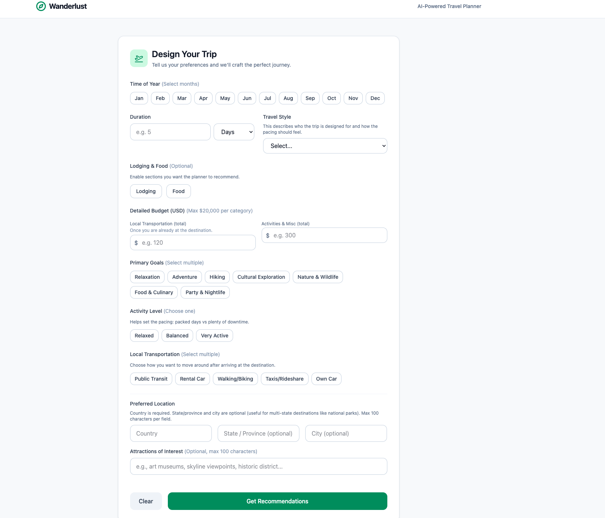

# AI Travel Planner

## Overview

This is an AI-powered trip planning project.

<div align="center">
  
</div>

## Run Locally

**Prerequisites:** Node.js, Redis (for caching API calls)

1. Install dependencies:
   `npm install`
2. Copy `.env.example` to `.env`
3. Set the required server-side variables in `.env`:
   - `GEMINI_API_KEY`, `ANTHROPIC_API_KEY`, or `OPENAI_API_KEY` (at least one)
   - `TOMTOM_SEARCH_API_KEY`
   - `REDIS_URL` (Required for caching tool calls)
   - `DEBUG_LLM_ROUTER=true` (Optional: set to `true` to see backend debug logs)
4. Run locally with Vercel (recommended so serverless functions see env vars):
   `npx vercel dev`

## Local Development and Testing

Run tests:
`npm run test:coverage`

## Architecture

This project uses a highly optimized, defensive **Multi-Agent Architecture** to generate travel plans without hallucinations:

### 1. Recommendations Stage (`api/recommendations.ts`)

Suggests 3 high-level travel destinations based on user preferences. Budget estimation is fully dynamic, dynamically calculating costs based only on the features the user selected (Lodging, Food, Misc).

### 2. Itinerary Stage (`api/itinerary.ts`)

Uses a two-pass agent architecture to ensure high-quality, fact-checked itineraries:

- **Draft Agent (Without External Tools):** Uses general destination knowledge to rapidly draft a geographically coherent, well-paced day-by-day plan. It focuses entirely on flow and logistics, without worrying about precise addresses.
- **Verification & Formatting Concierge Agent (With Search API Tools):** Takes the drafted plan and uses the TomTom Search API (`search_place` tool) to fact-check the existence, address, and official websites of the proposed places. It then formats the final, verified response into clean Markdown.

## Dynamic Feature Flags

## Project Structure

The project is organized into a monorepo-style structure with distinct frontend, backend, and shared utility directories.

```
/
├── api/                  # Vercel Serverless Functions (Backend)
│   ├── itinerary.ts      # Itinerary generation endpoint
│   └── recommendations.ts  # Recommendation generation endpoint
├── src/                  # React Frontend Application
│   ├── components/       # Reusable React components
│   │   ├── Itinerary.tsx       # Displays the final generated itinerary
│   │   ├── Recommendations.tsx # Displays the 3 travel options
│   │   └── TravelForm.tsx      # Main user input form
│   ├── services/         # API client services (e.g., fetching data)
│   │   └── geminiService.ts  # Service to call backend API routes
│   ├── App.tsx           # Main application component
│   ├── index.css         # Global CSS styles
│   ├── main.tsx          # Main entry point for the React app
│   └── vite-env.d.ts     # Vite TypeScript environment declarations
├── tests/                # Vitest test suite
│   ├── api/              # Tests for serverless functions
│   │   ├── itinerary.test.ts
│   │   └── recommendations.test.ts
│   ├── src/              # Tests for React components and services
│   │   ├── components/
│   │   │   ├── Itinerary.test.tsx
│   │   │   ├── Recommendations.test.tsx
│   │   │   └── TravelForm.test.tsx
│   │   ├── services/
│   │   │   └── geminiService.test.ts
│   │   └── App.test.tsx
│   ├── tools/            # Tests for tool definitions and API clients
│   │   ├── anthropicTools.test.ts
│   │   ├── geminiTools.test.ts
│   │   ├── openaiTools.test.ts
│   │   ├── tomtomSearch.test.ts
│   │   └── toolDefinitions.test.ts
│   ├── utils/            # Tests for shared utility functions
│   │   ├── apiHelpers.test.ts
│   │   ├── foodPreferences.test.ts
│   │   ├── http.test.ts
│   │   ├── llmRouter.test.ts
│   │   ├── lodgingPreferences.test.ts
│   │   ├── redis.test.ts
│   │   ├── requestValidation.test.ts
│   │   └── tripContext.test.ts
│   ├── helpers.ts        # Test helpers (e.g., form filling)
│   └── setup.ts          # Vitest test setup file
├── utils/                # Shared utilities for both frontend and backend
│   ├── apiHelpers.ts     # Helpers for API request/response handling
│   ├── foodPreferences.ts  # Logic for formatting food preferences
│   ├── http.ts           # HTTP body parsing utilities
│   ├── llmRouter.ts      # Routes requests to different LLM providers
│   ├── lodgingPreferences.ts # Logic for formatting lodging preferences
│   ├── redis.ts          # Redis client and caching logic
│   ├── requestValidation.ts # Schemas and functions for validating API inputs
│   └── tripContext.ts    # Builds prompt context from user data
├── tools/                # LLM tool definitions and external API clients
│   ├── anthropicTools.ts # Anthropic-specific tool wrappers
│   ├── geminiTools.ts    # Gemini-specific tool wrappers
│   ├── openaiTools.ts    # OpenAI-specific tool wrappers
│   ├── tomtomSearch.ts   # TomTom Search API client and tool definition
│   └── toolDefinitions.ts # Core tool definitions (e.g., SEARCH_PLACE_TOOL)
├── .env.example          # Environment variable template
├── index.html            # Main HTML entry point for Vite
├── package.json          # Project dependencies and scripts
├── package-lock.json     # Locked dependency tree
├── tsconfig.json         # TypeScript compiler configuration
├── tsconfig.node.json    # TypeScript compiler configuration for Node/Vite build
├── vercel.json           # Vercel configuration (routes, serverless functions)
├── vite.config.ts        # Vite build and test configuration
└── README.md
```

The application uses dynamic prompt injection to control LLM behavior and conserve API calls.
Features like **Lodging** and **Food** act as feature flags:

- If a feature is disabled, the logic is entirely removed from the prompt, preventing the LLM from hallucinating filler content.
- If **Food** is enabled but set to "Nice to Have," the Verification Agent will skip making tool calls for restaurants to save resources, keeping the suggestions area-based and generalized.

## Notes & Debugging

- API keys are used only by the backend serverless routes in `api/`. They are not injected into the browser bundle.
- Run `npx vercel dev` to start the frontend and serverless API routes together.
- `DEBUG_LLM_ROUTER=true` enables extra backend logging for LLM and place-search debugging.
- The project defaults to Gemini for Verification, but can be overridden by setting `ITINERARY_VERIFICATION_PROVIDER=openai` (or `anthropic`).
